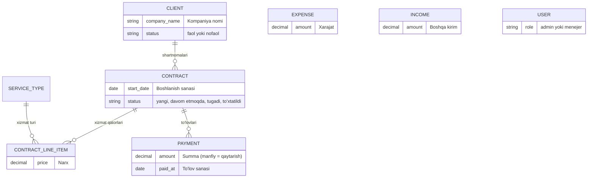

# WTMA Finance Panel — Moliyaviy Boshqaruv Tizimi

**Mijozlar, shartnomalar, to'lovlar, qarzdorlik va biznes moliyasini bir joyda boshqaruvchi zamonaviy B2B veb-panel.**

> Ushbu hujjat tizimning barcha imkoniyatlari, texnik xususiyatlari va ishga tushirish tartibi bilan tanishtirish uchun tayyorlangan. Loyiha **to'liq ishga tayyor** (production-ready) holatda.

---

## Mundarija

1. [Loyiha haqida qisqacha](#loyiha-haqida-qisqacha)
2. [Nima uchun bu tizim?](#nima-uchun-bu-tizim)
3. [Tizimning barcha bo'limlari va imkoniyatlari](#tizimning-barcha-bolimlari-va-imkoniyatlari)
4. [Foydalanuvchi rollari va huquqlar](#foydalanuvchi-rollari-va-huquqlar)
5. [Xavfsizlik](#xavfsizlik)
6. [Ko'p tillilik](#kop-tillilik)
7. [Dizayn va foydalanuvchi tajribasi](#dizayn-va-foydalanuvchi-tajribasi)
8. [Texnologiyalar (nima asosida qurilgan)](#texnologiyalar-nima-asosida-qurilgan)
9. [Ma'lumotlar tuzilmasi](#malumotlar-tuzilmasi)
10. [Ishga tushirish (Docker orqali)](#ishga-tushirish-docker-orqali)
11. [Production (jonli serverga chiqarish)](#production-jonli-serverga-chiqarish)
12. [Excel orqali ma'lumot ko'chirish](#excel-orqali-malumot-kochirish)
13. [Sifat nazorati — testlar](#sifat-nazorati--testlar)
14. [Kelajakdagi rivojlanish yo'nalishlari](#kelajakdagi-rivojlanish-yonalishlari)
15. [Tez-tez uchraydigan savollar](#tez-tez-uchraydigan-savollar)
16. [Qo'shimcha hujjatlar](#qoshimcha-hujjatlar)

---

## Loyiha haqida qisqacha

WTMA Finance Panel — kompaniyalar uchun **mijozlar bazasi, xizmat shartnomalari, to'lovlar va umumiy moliyaviy holatni** bitta tizimda kuzatib borish imkonini beruvchi ichki boshqaruv paneli.

Tizim quyidagi savollarga tezkor javob beradi:

- Bizda hozir nechta faol mijoz bor va ular qancha qarzdor?
- Bu oyda qancha tushum va chiqim bo'ldi, sof foyda qancha?
- Qaysi xizmat turi eng ko'p daromad keltiryapti?
- Qaysi shartnomalarning muddati tugayapti?
- Kim, qachon, qaysi ma'lumotni o'zgartirgan?

Barcha ma'lumotlar **PostgreSQL** ma'lumotlar bazasida xavfsiz saqlanadi, tizim **Docker** orqali bir buyruq bilan ishga tushiriladi va istalgan serverda (bulut yoki lokal) joylashtirilishi mumkin.

---

## Nima uchun bu tizim?

| Muammo | WTMA Finance qanday hal qiladi |
|--------|-------------------------------|
| Excel jadvallarida mijoz/shartnoma ma'lumotlari tarqoq | Bitta markazlashtirilgan baza, qidiruv va filtrlar |
| Kim qarzdor, kim to'lagan — aniq emas | Har bir mijoz va shartnoma bo'yicha avtomatik qarz hisob-kitobi |
| Moliyaviy hisobotlar qo'lda tayyorlanadi | Dashboard'da real vaqtda diagrammalar, Excel/PDF eksport bir tugma bilan |
| Xato qilingan yozuvni kim o'zgartirgani noma'lum | To'liq **audit jurnali** — har bir amal qayd etiladi, kerak bo'lsa arxivdan tiklanadi |
| Ma'lumotlarni yo'qotib qo'yish xavfi | **Soft-delete** — o'chirilgan yozuvlar arxivga tushadi, butunlay yo'qolmaydi |
| Bir nechta xodim bir vaqtda ishlashi kerak | Rol asosida kirish huquqlari (admin / menejer), har biriga alohida login |
| Eski Excel tarixini yangi tizimga o'tkazish qiyin | Mijozlar, shartnomalar va moliya tarixini Excel orqali import qilish |

---

## Tizimning barcha bo'limlari va imkoniyatlari

### 1. Bosh sahifa — Dashboard

Tizimga kirgandan so'ng foydalanuvchi darhol umumiy holatni ko'radi:

- **KPI kartalar** — umumiy qarz, oylik tushum, reja va fakt taqqoslash, sof foyda, foyda marjasi
- **Mijozlar holati** va **Shartnomalar holati** — dumaloq diagrammalar (donut chart), yonma-yon joylashgan
- **Oylik tushum grafigi** — daromad tendensiyasi (oxirgi 6/12 oy)
- **Xizmat turlari bo'yicha hajm** — qaysi xizmat qancha daromad keltirayotgani (barcha xizmat turlari alohida ko'rsatiladi)
- **Top mijozlar (LTV)** — eng ko'p to'lov qilgan mijozlar reytingi, saralash va 10/20/30 ta ko'rsatish tanlovi bilan
- **Muddati yaqinlashayotgan shartnomalar** — necha kun qolganini sozlash imkoniyati bilan
- **To'langan / qarz balansi** — umumiy progress ko'rsatkichi

### 2. Mijozlar (`/clients`)

- Mijozlar bazasini to'liq boshqarish: qo'shish, tahrirlash, o'chirish (arxivga)
- Har bir mijoz uchun **holat**: faol / nofaol
- **Qidiruv va filtrlash**: nomi, shahar, holat, qarz holati (barchasi / faqat qarzdorlar / qarzi yo'qlar / ortiqcha to'laganlar)
- **Mijoz kartasi** — har bir mijozning shaxsiy sahifasi: barcha shartnomalari, to'lovlari, umumiy summa/qarz
- **Logotip yuklash** — mijoz kompaniyasining rasmiy belgisi (PNG/JPEG/WEBP/SVG)
- **Excel import** — ko'plab mijozni bir vaqtning o'zida yuklash
- **Eksport** — Excel yoki PDF formatda, tanlangan mijozlarni ham alohida eksport qilish mumkin

### 3. Shartnomalar (`/contracts`)

- Har bir shartnomada **bir nechta xizmat qatori** bo'lishi mumkin (masalan: SMM + Video ishlab chiqish bitta shartnomada)
- **Ish jarayoni holati**: `Yangi` → `Davom etmoqda` → `Tugadi` / `To'xtatildi`
- Holatga qarab jadvalda rangli ko'rsatish (masalan, tugagan shartnomalar boshqa rangda)
- Shartnoma raqami va ЭСФ (elektron schyot-faktura) raqamini kiritish
- Alohida xizmatni yoki butun shartnomani **bekor qilish**, keyin qayta faollashtirish imkoni
- Shartnomani **nusxalash** (takroriy shartnoma tuzishda vaqt tejaydi)
- **PDF hujjatlar** avtomatik generatsiyasi: shartnoma matni, schyot-faktura, ish qabul topshirish akti
- Kuchli filtrlash: qidiruv, sana oralig'i, holat, xizmat turi, qarz holati bo'yicha
- **Excel'dan import** — eski shartnomalar tarixini moslashuvchan ustun tanish bilan yuklash
- Ko'p tanlab (checkbox) **ommaviy eksport yoki arxivga o'tkazish**
- Qidiruv imkoniyatli mijoz tanlash oynasi (uzun ro'yxatlarda tezkor topish)

### 4. To'lovlar (`/payments`)

- Har bir shartnoma bo'yicha kelgan to'lovlarni qayd qilish
- **Qaytarish (refund)** — manfiy summa sifatida kiritiladi va qizil rang bilan ajratiladi
- **"Saqlash va yana qo'shish"** — ketma-ket bir nechta to'lov kiritishda qulaylik
- **To'lovni tahrirlash** — summasi, sanasi yoki izohi xato kiritilgan bo'lsa, tuzatish imkoni (o'zgarish audit jurnaliga yoziladi)
- Qidiruv: mijoz nomi, shartnoma raqami, telefon bo'yicha
- Bir nechtasini tanlab arxivga o'tkazish yoki eksport qilish (arxivga o'tkazish — faqat administrator)

### 5. Moliya (`/finance`)

- **Yillik daromad grafigi** — 2019-yildan hozirgi yilgacha, mijoz to'lovlari va chiqimlar solishtirmasi
- **Oborot bo'limi** — yil (2019–2035 yoki barcha yillar) va davr (butun yil yoki chorak) bo'yicha filtrlash
- Asosiy KPI kartalar: **Jami tushum**, **Jami chiqim**, **Sof balans**
- **Xarajatlar taqsimoti** — qaysi xarajat toifasi (ijara, ish haqi, marketing va h.k.) qancha ulush egallaganini ko'rsatuvchi diagramma
- **Birlashgan moliyaviy jurnal (ledger)** — mijoz to'lovlari, boshqa kirimlar va xarajatlar bitta jadvalda, xronologik tartibda
- Qo'lda kirim/chiqim kiritish (ijara, ish haqi, boshqa xarajatlar va daromadlar)
- Ledgerdagi mijoz to'lovlarini bevosita tahrirlash imkoni
- **Excel import** — eski moliya tarixini yuklash

### 6. Qarzdorlik nazorati

- "Faqat qarzdorlar" filtri — Mijozlar sahifasida bir amalda ko'rish
- Shartnomalar bo'yicha "Qarz bor" filtri
- Qarzdorlik bo'yicha umumiy statistika (Dashboard va eksport hisobotlarida)

### 7. Xizmat turlari (`/service-types`)

- Kompaniya taqdim etadigan xizmatlar katalogi (masalan: SMM, Branding, Video, Sayt yaratish)
- Har bir xizmat bo'yicha statistika: nechta shartnomada ishlatilgan, qancha daromad keltirgan
- Faol/nofaol holatga o'tkazish

### 8. Xodimlar (`/employees`) — faqat administrator

- Tizim foydalanuvchilarini boshqarish: qo'shish, tahrirlash, faollashtirish/bloklash
- Rol tayinlash: **administrator** yoki **menejer**
- Har bir xodimning kirish tarixi va audit yozuvlariga havola

### 9. Arxiv (`/trash`) — faqat administrator

- O'chirilgan (soft-delete) mijozlar, shartnomalar, to'lovlar, kirim/chiqimlar bir joyda
- Qidiruv va sahifalash
- Bir tugma bilan **qaytarish (tiklash)**

### 10. O'zgarishlar tarixi — Audit jurnali (`/audit-log`) — faqat administrator

- **Kim, qachon, nimani o'zgartirgani** to'liq tarixi
- Har bir o'zgarish "eski qiymat → yangi qiymat" ko'rinishida ko'rsatiladi (masalan: `Summa: 100 000 → 250 000`)
- Sana, ma'lumot turi bo'yicha filtrlash
- Arxivga o'tkazilgan yozuvlarni to'g'ridan-to'g'ri shu sahifadan tiklash imkoni

### 11. Profil sozlamalari (`/profile`)

- Parolni o'zgartirish
- Til (o'zbek/rus) va mavzu (yorug'/qorong'i) tanlash
- Bildirishnoma sozlamalari (necha kun qolganda ogohlantirish)
- Oylik reja belgilash (administrator)
- Kompaniya rekvizitlari — PDF hujjatlarda ishlatiladigan ma'lumotlar
- Kirish tarixi (qachon, qaysi qurilmadan kirilgani)

### 12. Bildirishnomalar

- Sarlavha qatoridagi qo'ng'iroq belgisi orqali muddati yaqinlashayotgan shartnomalar va muddati o'tgan qarzlar haqida ogohlantirish
- Har bir amal (yaratish/tahrirlash/o'chirish) uchun ekran burchagida chiqadigan tasdiqlash xabarlari (toast)

---

## Foydalanuvchi rollari va huquqlar

Tizimda ikki xil rol mavjud — har bir xodimga vazifasiga mos ravishda huquq beriladi:

| Amal | Administrator | Menejer |
|------|:---:|:---:|
| Mijoz / shartnoma / to'lov yaratish va ko'rish | ✅ | ✅ |
| To'lov, kirim, chiqim ma'lumotlarini tahrirlash | ✅ | ✅ |
| Moliya va hisobotlarni ko'rish, Excel/PDF eksport | ✅ | ✅ |
| Yozuvlarni arxivga o'tkazish (o'chirish) | ✅ | ❌ |
| Xizmat turlarini qo'shish/o'chirish | ✅ | ❌ |
| Xodimlarni boshqarish | ✅ | ❌ |
| Arxiv va audit jurnaliga kirish | ✅ | ❌ |
| Oylik reja va kompaniya sozlamalarini o'zgartirish | ✅ | ❌ |

Bu bo'linish orqali menejerlar kundalik ishni erkin bajaradi, lekin nozik amallar (o'chirish, tizim sozlamalari) faqat administrator nazoratida qoladi.

---

## Xavfsizlik

- **JWT token asosida autentifikatsiya** — har bir foydalanuvchi shaxsiy login/parol bilan kiradi
- Parollar **bcrypt** algoritmi bilan shifrlangan holda saqlanadi (ochiq matnda hech qachon saqlanmaydi)
- **Login urinishlarini cheklash (rate limiting)** — parolni tasodifiy topishga urinishlarning oldini oladi
- **Rol asosida kirish nazorati (RBAC)** — har bir amal foydalanuvchi roliga qarab tekshiriladi
- **To'liq audit jurnali** — barcha o'zgarishlar kim va qachon amalga oshirgani bilan qayd etiladi
- **Soft-delete** — hech qanday ma'lumot butunlay yo'qolmaydi, xato o'chirish arxivdan tiklanadi
- Production muhitida **HTTPS (SSL sertifikat)** avtomatik ravishda ta'minlanadi (Let's Encrypt)
- Xavfsizlik sarlavhalari (security headers): `X-Frame-Options`, `X-Content-Type-Options`, `Strict-Transport-Security`

---

## Ko'p tillilik

Tizim to'liq ikki tilda ishlaydi:

- 🇺🇿 **O'zbek tili** (asosiy)
- 🇷🇺 **Rus tili**

Har bir foydalanuvchi o'zi uchun qulay tilni Profil bo'limidan tanlashi mumkin, tanlov saqlanib qoladi.

---

## Dizayn va foydalanuvchi tajribasi

- **Minimalist, premium B2B dizayn** — chalkash emas, professional ko'rinish
- **Yorug' / Qorong'i mavzu (Dark mode)** — foydalanuvchi tanlovi bo'yicha
- Silliq, ko'zni charchatmaydigan **animatsiyalar** (60 kadr/sekund)
- **Mobil qurilmalarga moslashgan** — telefon va planshetda ham qulay ishlaydi
- **PWA (Progressive Web App)** — tizimni telefon/kompyuterga ilova sifatida o'rnatish mumkin, internet uzilganda ham asosiy interfeys ochiladi
- Global qidiruv — kerakli mijoz, shartnoma yoki ma'lumotni tezda topish
- Filtrlar va sozlamalar avtomatik saqlanadi (keyingi kirishda qayta sozlash shart emas)

---

## Texnologiyalar (nima asosida qurilgan)

Tizim zamonaviy, sinovdan o'tgan va keng qo'llaniladigan texnologiyalar asosida qurilgan — bu barqarorlik, xavfsizlik va kelajakda kengaytirish imkoniyatini ta'minlaydi.

| Qatlam | Texnologiya | Nima uchun tanlangan |
|--------|-------------|----------------------|
| Backend (server) | **FastAPI** (Python) | Yuqori tezlik, xavfsiz va aniq ma'lumot validatsiyasi |
| Ma'lumotlar bazasi | **PostgreSQL** | Dunyodagi eng ishonchli, ochiq kodli ma'lumotlar bazasi |
| Frontend (interfeys) | **React + TypeScript** | Tezkor, barqaror va xatolarga chidamli interfeys |
| Dizayn tizimi | **Tailwind CSS + shadcn/ui** | Zamonaviy, moslashuvchan va tez ishlaydigan UI |
| Animatsiya | **Framer Motion** | Silliq va professional harakatlar |
| Grafik va diagrammalar | **Recharts** | Interaktiv va aniq statistik ko'rinishlar |
| Konteynerlashtirish | **Docker** | Istalgan serverda bir xil ishlashni kafolatlaydi |
| HTTPS | **Caddy** (Let's Encrypt) | Avtomatik va bepul SSL sertifikat |
| Sifat nazorati | **pytest + Playwright** | Har bir o'zgarish avtomatik test qilinadi |

---

## Ma'lumotlar tuzilmasi

Tizimning asosiy obyektlari va ular orasidagi bog'liqlik:


```mermaid
erDiagram
    CLIENT ||--o{ CONTRACT : "shartnomalari"
    CONTRACT ||--o{ CONTRACT_LINE_ITEM : "xizmat qatorlari"
    CONTRACT ||--o{ PAYMENT : "to'lovlari"
    SERVICE_TYPE ||--o{ CONTRACT_LINE_ITEM : "xizmat turi"

    CLIENT {
        string company_name "Kompaniya nomi"
        string status "faol yoki nofaol"
    }
    CONTRACT {
        date start_date "Boshlanish sanasi"
        string status "yangi, davom etmoqda, tugadi, to'xtatildi"
    }
    CONTRACT_LINE_ITEM {
        decimal price "Narx"
    }
    PAYMENT {
        decimal amount "Summa (manfiy = qaytarish)"
        date paid_at "To'lov sanasi"
    }
    EXPENSE { decimal amount "Xarajat" }
    INCOME { decimal amount "Boshqa kirim" }
    USER { string role "admin yoki menejer" }
```

**Asosiy hisob-kitob qoidalari:**

- Shartnoma summasi = bekor qilinmagan xizmat qatorlarining yig'indisi
- To'langan summa = shu shartnoma bo'yicha barcha to'lovlar (qaytarishlar ayiriladi)
- Qarz = Shartnoma summasi − To'langan summa (manfiy bo'lsa — ortiqcha to'lov)
- Har bir o'zgarish avtomatik audit jurnaliga yoziladi

---

## Ishga tushirish (Docker orqali)

Tizimni ishga tushirish uchun kompyuterda faqat **Docker** o'rnatilgan bo'lishi kifoya — boshqa hech qanday qo'shimcha dastur talab qilinmaydi.

```bash
git clone https://github.com/SunnatDevPy/Finance_kpi.git Finance_managment
cd Finance_managment

docker compose up --build
```

Birinchi ishga tushishda tizim avtomatik ravishda:
1. Ma'lumotlar bazasini tayyorlaydi
2. Kerakli jadvallarni yaratadi
3. Boshlang'ich administrator hisobini va standart xizmat turlarini qo'shadi
4. Server va interfeysni ishga tushiradi

| Xizmat | Manzil |
|--------|--------|
| Tizim interfeysi | http://localhost:5173 |
| Server (API) hujjatlari | http://localhost:8002/docs |

**Standart kirish:** login `admin`, parol `admin123` (birinchi kirishdan keyin albatta o'zgartirilishi tavsiya etiladi)

To'xtatish: `docker compose down`

---

## Production (jonli serverga chiqarish)

Tizim jonli (production) serverga chiqarish uchun to'liq tayyor konfiguratsiyaga ega:

```bash
git clone https://github.com/SunnatDevPy/Finance_kpi.git /var/www/finance
cd /var/www/finance
cp .env.prod.example .env.prod
# JWT_SECRET, POSTGRES_PASSWORD, ADMIN_PASSWORD — kuchli maxfiy qiymatlar bilan to'ldiriladi

docker compose -f docker-compose.prod.yml --env-file .env.prod up -d --build
```

Production muhitida qo'shimcha ravishda:

- **HTTPS (SSL)** — Caddy orqali avtomatik, bepul sertifikat (Let's Encrypt)
- Server ishlashi optimallashtirilgan (ko'p worker jarayoni)
- Yuklangan fayllar (logotiplar) alohida xavfsiz joyda saqlanadi
- Xavfsizlik sarlavhalari va domen sozlamalari tayyor

Domen (masalan `wtma.okaposai.uz`) serverga yo'naltirilgandan so'ng, tizim o'zi SSL sertifikatini oladi — qo'shimcha sozlash shart emas.

---

## Excel orqali ma'lumot ko'chirish

Eski Excel jadvallardagi ma'lumotlarni yangi tizimga bir zumda ko'chirish mumkin:

| Nima ko'chiriladi | Qayerdan |
|-------------------|----------|
| Mijozlar ro'yxati | Mijozlar sahifasi → "Excel'dan import" |
| Shartnomalar tarixi | Shartnomalar sahifasi → "Excel'dan import" |
| Moliya tarixi (kirim/chiqim) | Moliya sahifasi → import |

Ustunlar tartibi muhim emas — tizim sarlavha matniga qarab (o'zbek yoki rus tilida) mos ustunni o'zi aniqlaydi. Takroriy yozuvlar (masalan bir xil mijoz + shartnoma raqami) avtomatik o'tkazib yuboriladi, ma'lumotlar ikki marta qo'shilib qolmaydi.

---

## Sifat nazorati — testlar

Loyihaning ishonchliligini ta'minlash uchun har bir o'zgarish avtomatik tarzda tekshiriladi:

- **100+ avtomatik test** — mijozlar, shartnomalar, to'lovlar, moliya, qarz hisob-kitoblari, arxiv/tiklash, audit jurnali bo'yicha
- **End-to-End (E2E) testlar** — haqiqiy foydalanuvchi harakatlarini simulatsiya qiladi (kirish, mijoz qo'shish, shartnoma tuzish va h.k.)
- Har bir kod o'zgarishi **avtomatik tekshiruv** (CI) orqali o'tadi — xato bo'lgan o'zgarish ishlab chiqarishga chiqmaydi

---

## Kelajakdagi rivojlanish yo'nalishlari

Tizim hozirda **to'liq ishlaydigan, production darajasidagi** mahsulot. Quyidagilar — kelajakda qo'shilishi mumkin bo'lgan qo'shimcha imkoniyatlar:

| Yo'nalish | Tavsif |
|-----------|--------|
| Email / Telegram bildirishnomalar | Hozir faqat tizim ichida ogohlantirish; tashqi kanalga xabar yuborish qo'shilishi mumkin |
| Avtomatik qarzdorlik eslatmalari | Muddati o'tgan qarzlar bo'yicha avtomatik xabar yuborish |
| Rejalashtirilgan hisobotlar | Oylik hisobotni avtomatik Excel/PDF sifatida yuborish |
| Kengaytirilgan huquqlar tizimi | Masalan, xodimga faqat o'z mijozlarini ko'rish huquqi berish |
| Bir nechta filial/kompaniya qo'llab-quvvatlash | Hozir bitta kompaniya profili bilan ishlaydi |
| Ikki bosqichli autentifikatsiya (2FA) | Administrator hisoblari uchun qo'shimcha xavfsizlik |

---

## Tez-tez uchraydigan savollar

**Ma'lumotlar qayerda saqlanadi?**
Barcha ma'lumotlar sizning serveringizdagi (yoki tanlangan bulut xizmatidagi) PostgreSQL ma'lumotlar bazasida saqlanadi. Ma'lumotlar uchinchi tomon xizmatlariga yuborilmaydi.

**Agar xodim adashib ma'lumotni o'chirsa nima bo'ladi?**
Hech narsa yo'qolmaydi — o'chirilgan yozuv Arxiv bo'limiga tushadi va administrator uni bir tugma bilan qayta tiklashi mumkin.

**Ko'p xodim bir vaqtda ishlay oladimi?**
Ha, har bir xodim uchun alohida login yaratiladi, ular bir vaqtning o'zida turli qurilmalardan kirishi mumkin.

**Tizimni telefon orqali ham ishlatish mumkinmi?**
Ha, interfeys mobil qurilmalarga to'liq moslashgan va uni telefon ekraniga ilova sifatida o'rnatish mumkin.

**Eski Excel jadvallarimizni yangi tizimga ko'chirish mumkinmi?**
Ha, mijozlar, shartnomalar va moliya tarixi Excel fayl orqali import qilinadi.

---

## Qo'shimcha hujjatlar

| Fayl | Mazmuni |
|------|---------|
| [`PLAN.md`](./PLAN.md) | Loyihaning to'liq ishlab chiqilish tarixi |
| [`CONTEXT.md`](./CONTEXT.md) | Tizim atamalari lug'ati |
| [`docs/adr/`](./docs/adr/) | Texnik arxitektura qarorlari |

---

*Savol va takliflar bo'yicha loyiha egasi bilan bog'laning.*
