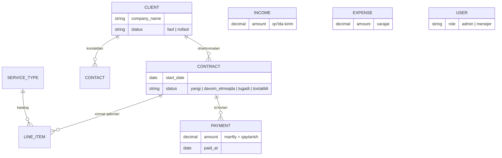

<div align="center">


# WTMA Finance

**Mijozlar, shartnomalar, to‘lovlar va biznes moliyasi — bitta ichki panel.**

World Textile Marketing Agency uchun qurilgan B2B moliyaviy boshqaruv tizimi.
Qarz, tushum va xarajatlar real vaqtda ko‘rinadi. Excel o‘rniga yagona baza.

[](https://github.com/SunnatDevPy/Finance_kpi/actions/workflows/ci.yml)
[](frontend)
[](backend)
[](docker-compose.yml)
[](frontend/src/i18n/locales)

[Jonli panel](https://wtma.okaposai.uz) · [Ishga tushirish](#ishga-tushirish) · [Domen atamalari](./CONTEXT.md)

</div>

---

## Nima uchun

Kompaniya moliyasi odatda Excel, chat va alohida jadvallarga tarqaladi.
WTMA Finance shu oqimni bitta tizimga yig‘adi.

| Oldin | Endi |
|--------|------|
| Kim qarzdor — aniq emas | Har bir mijoz va shartnoma bo‘yicha avtomatik qarz |
| Oylik hisobot qo‘lda yig‘iladi | Dashboard: oy yoki yil, reja va fakt, o‘sish foizi |
| Kim nima o‘zgartirgani noma’lum | Audit jurnali: eski qiymat → yangi qiymat |
| O‘chirilgan yozuv yo‘qoladi | Soft-delete: arxivdan bir tugma bilan tiklash |
| Eski Excel tarixini ko‘chirish qiyin | Mijoz, shartnoma va moliya importi |

---

## Imkoniyatlar

### Dashboard

Kirish zahoti umumiy holat ochiladi.

- **Oy \| Yil** — kalendar oyi yoki to‘liq yil bo‘yicha tushum, qarz va reja
- KPI kartalar: tushum, reja/fakt, o‘sish, sof foyda, undirish darajasi
- Tushum kartasini bosib davr ichidagi to‘lov va kirimlarni ko‘rish
- Xizmat turlari bo‘yicha hajm, top mijozlar (LTV), yaqinlashayotgan shartnomalar
- Mijozlar va shartnomalar holati — donut diagrammalar

### Mijozlar va shartnomalar

- Mijoz kartasi: kontaktlar, shartnomalar, to‘lovlar, umumiy qarz
- Logotip, qidiruv, holat va qarz filtrlari (qarzdor / qarzi yo‘q / ortiqcha to‘lagan)
- Shartnomada bir nechta xizmat qatori: SMM + video bitta hujjatda
- Holat: `Yangi` → `Davom etmoqda` → `Tugadi` / `To‘xtatildi`
- PDF: shartnoma, schyot-faktura, akt — kompaniya rekvizitlari bilan
- Nusxalash, bekor qilish, ommaviy arxiv va eksport

### To‘lovlar va moliya

- To‘lovlar **sana bo‘yicha**, yangidan eski tartibda ochiladi
- Qaytarish — manfiy summa, qizil belgi
- Birlashgan jurnal: shartnoma to‘lovi + qo‘lda kirim + chiqim
- Oborot: yil, chorak, xarajat taqsimoti
- Avtomatik hisob **sanadan** boshlanadi — Profil’da yil, oy va kun belgilanadi.
  Shu kundan oldingi shartnoma to‘lovlari moliyaga tushmaydi, faqat qo‘lda kiritilgan kirim/chiqim qoladi

### Boshqaruv

- Rollar: **administrator** va **menejer**
- Xodimlar, kirish tarixi, audit, arxiv — faqat admin
- O‘zbek / rus tili, yorug‘ / qorong‘i mavzu
- PWA: telefon yoki kompyuterga ilova sifatida o‘rnatish
- Bildirishnomalar: muddati yaqin shartnoma va kechikkan qarz

---

## Rollar

| Amal | Admin | Menejer |
|------|:-----:|:-------:|
| Mijoz, shartnoma, to‘lov, moliya | ✅ | ✅ |
| Excel / PDF eksport | ✅ | ✅ |
| Arxivga o‘tkazish | ✅ | |
| Xodimlar, audit, arxiv | ✅ | |
| Oylik reja, avtomatik hisob sanasi, rekvizitlar | ✅ | |

Menejer kundalik ishni qiladi. O‘chirish va tizim sozlamalari admin nazoratida.

---

## Texnologiyalar

```text
React 19 + TypeScript + Vite + Tailwind + shadcn/ui + Framer Motion + Recharts
        │
        ▼  /api/v1
FastAPI + SQLAlchemy + Alembic + PostgreSQL 16
        │
        ▼
Docker Compose          Production: Caddy + Let's Encrypt
```

| Qatlam | Stack |
|--------|--------|
| Interfeys | React 19, TypeScript, Tailwind, shadcn/ui, Framer Motion |
| Diagrammalar | Recharts |
| API | FastAPI, Pydantic, JWT, bcrypt |
| Baza | PostgreSQL 16, Alembic migratsiyalar |
| Fayllar | Excel import/eksport (`openpyxl`), PDF (`reportlab`) |
| Ishga tushirish | Docker Compose; prod’da Caddy HTTPS |

Dizayn: minimalist B2B, Apple/shadcn uslubi — yorqin “multfilm” palitra yo‘q.

---

## Ma’lumotlar modeli


```mermaid
erDiagram
    CLIENT ||--o{ CONTRACT : "shartnomalari"
    CLIENT ||--o{ CONTACT : "kontaktlari"
    CONTRACT ||--o{ LINE_ITEM : "xizmat qatorlari"
    CONTRACT ||--o{ PAYMENT : "to'lovlari"
    SERVICE_TYPE ||--o{ LINE_ITEM : "katalog"

    CLIENT {
        string company_name
        string status "faol | nofaol"
    }
    CONTRACT {
        date start_date
        string status "yangi | davom_etmoqda | tugadi | toxtatildi"
    }
    PAYMENT {
        decimal amount "manfiy = qaytarish"
        date paid_at
    }
    INCOME {
        decimal amount "qo'lda kirim"
    }
    EXPENSE {
        decimal amount "xarajat"
    }
    USER {
        string role "admin | menejer"
    }
```

**Hisob-kitob**

- Shartnoma summasi = bekor qilinmagan xizmat qatorlari
- To‘langan = shu shartnoma to‘lovlari (qaytarish ayiriladi)
- Qarz = summa − to‘langan (manfiy = ortiqcha to‘lov)
- Moliya jurnali = avtomatik sanadan keyingi to‘lovlar + qo‘lda kirim + chiqim

---

## Ishga tushirish

Kompyuterda faqat **Docker** bo‘lsa kifoya.

```bash
git clone https://github.com/SunnatDevPy/Finance_kpi.git
cd Finance_kpi

docker compose up --build
```

Birinchi ishga tushishda migratsiya, boshlang‘ich admin va xizmat turlari avtomatik yaratiladi.

| Xizmat | Manzil |
|--------|--------|
| Panel | [http://localhost:5173](http://localhost:5173) |
| API (Swagger) | [http://localhost:8002/docs](http://localhost:8002/docs) |
| PostgreSQL | `localhost:5433` → `finance` / `finance` / `finance_db` |

**Dev login:** `admin` / `admin123` — birinchi kirishdan keyin parolni almashtiring.

To‘xtatish:

```bash
docker compose down
```

### Lokal (Docker’siz frontend)

```bash
cd frontend
npm ci
npm run dev
```

Vite: [http://localhost:3000](http://localhost:3000). API baribir `8002` portda ishlashi kerak.

---

## Production

```bash
git clone https://github.com/SunnatDevPy/Finance_kpi.git /var/www/finance
cd /var/www/finance
cp .env.prod.example .env.prod
```

`.env.prod` ichida `JWT_SECRET`, `POSTGRES_PASSWORD`, `ADMIN_PASSWORD` ni kuchli qiymatlar bilan to‘ldiring. `DOMAIN` ni server DNS’iga yo‘naltiring.

```bash
docker compose -f docker-compose.prod.yml --env-file .env.prod up -d --build
```

Caddy Let’s Encrypt orqali HTTPS beradi. Default domen: `wtma.okaposai.uz`.

---

## Excel import

Ustun tartibi muhim emas — sarlavha o‘zbek yoki rus tilida bo‘lsa, tizim o‘zi moslaydi. Takroriy yozuvlar o‘tkazib yuboriladi.

| Ma’lumot | Qayerdan |
|----------|----------|
| Mijozlar | Mijozlar → Excel’dan import |
| Shartnomalar | Shartnomalar → Excel’dan import |
| Kirim / chiqim | Moliya → import |

---

## Xavfsizlik

- JWT autentifikatsiya, parollar bcrypt bilan
- Login va parol almashtirishda rate limit
- Rol tekshiruvi har bir yozuv amalida
- Soft-delete + to‘liq audit
- Production: HTTPS, security headers (`HSTS`, `X-Frame-Options`, `X-Content-Type-Options`)

Ma’lumotlar sizning PostgreSQL’ingizda qoladi — uchinchi tomon xizmatiga yuborilmaydi.

---

## Test va CI

Har bir `main` push’da GitHub Actions ishlaydi: pytest, frontend build, Playwright E2E.

```powershell
# Windows — frontend build + backend test
powershell -NoProfile -ExecutionPolicy Bypass -File .cursor/skills/wtma-verify/scripts/verify.ps1
```

```bash
# Backend
cd backend && python -m pytest -q

# E2E (stack ishlayotganda)
cd frontend && npm run test:e2e
```

150+ backend test: to‘lovlar, moliya kesimi, dashboard, qarz, arxiv, audit.

---

## Hujjatlar

| Fayl | Mazmuni |
|------|---------|
| [`CONTEXT.md`](./CONTEXT.md) | Domen atamalari |
| [`docs/adr/`](./docs/adr/) | Arxitektura qarorlari |
| [`PLAN.md`](./PLAN.md) | Ishlar tarixi |
| [`AGENTS.md`](./AGENTS.md) | Agent / skill yo‘riqnomasi |

---

<div align="center">

**WTMA** · World Textile Marketing Agency

Savol va takliflar — loyiha egasi orqali.

</div>
